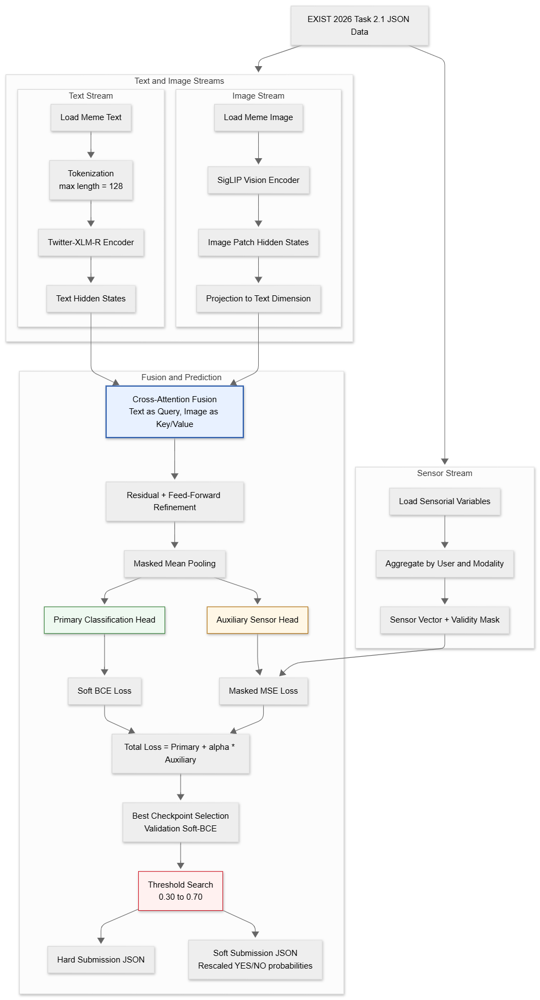

# FourBytes at EXIST 2026 Task 2.1


FourBytes_1 is our multimodal submission to EXIST 2026 Task 2.1 for sexism detection in memes. The system combines XLM-T text representations and SigLIP image features through a cross-attention fusion layer, then predicts both hard labels and soft probability distributions in the PyEvALL format.

## At a Glance

- `Hard track (ALL)`: rank `110`, F1 `0.7323`
- `Soft track (ALL)`: rank `56`, cross-entropy `0.9524`
- Stronger performance on `English` than `Spanish`
- Main remaining issue: `probability calibration` on the soft track

## Methodology



## Method

- `Text encoder`: `cardiffnlp/twitter-xlm-roberta-base`
- `Vision encoder`: `google/siglip-base-patch16-256`
- `Fusion`: text tokens attend to image patches with multi-head cross-attention
- `Targets`: soft labels from annotator votes
- `Validation`: stratified by language and annotator agreement
- `Training`: Hugging Face Accelerate, fp16 mixed precision, gradient checkpointing, early stopping
- `Inference`: threshold search from `0.30` to `0.70`, followed by hard prediction and soft-label rescaling

The implementation also includes an auxiliary sensor regression head for physiological variables released with the dataset, although the final submitted run disables that auxiliary loss.

## Official Results

Submitted run: `FourBytes_1`

| Split | Hard Rank | Hard F1 | Soft Rank | Cross-Entropy |
| --- | ---: | ---: | ---: | ---: |
| ALL | `110` | `0.7323` | `56` | `0.9524` |
| EN | `68` | `0.7633` | `47` | `0.9112` |
| ES | `151` | `0.7050` | `61` | `0.9915` |

## Repository

- `exist-subtask-2-1-final.ipynb`: training and inference pipeline
- `evaluate.py`: local PyEvALL evaluation script
- `align_gold_subsets.py`: aligns validation predictions with the matching gold subset
- `results/`: official leaderboard exports
- `evaluation/`: validator, baselines, and gold files
- `exist2026_paper/`: paper source and figures

## Quick Start

```bash
pip install -r requirements.txt
pip install notebook pyevall
jupyter notebook exist-subtask-2-1-final.ipynb
```

For local validation:

```bash
python align_gold_subsets.py
python evaluate.py
```

The notebook writes PyEvALL-formatted outputs such as `hard_submission.json` and `soft_submission.json`, and it can locate the dataset from common local, Kaggle, and Colab paths.

## Acknowledgements

We thank the organizers of EXIST 2026 for releasing the shared task, evaluation framework, and multimodal dataset that made this work possible. We also acknowledge the authors and maintainers of the pretrained models and open-source libraries used in this project, especially Hugging Face Transformers, Accelerate, XLM-T, and SigLIP. This work was carried out by the FourBytes team from the Department of Computer Science and Engineering, Sri Sivasubramaniya Nadar College of Engineering, Chennai, India.
